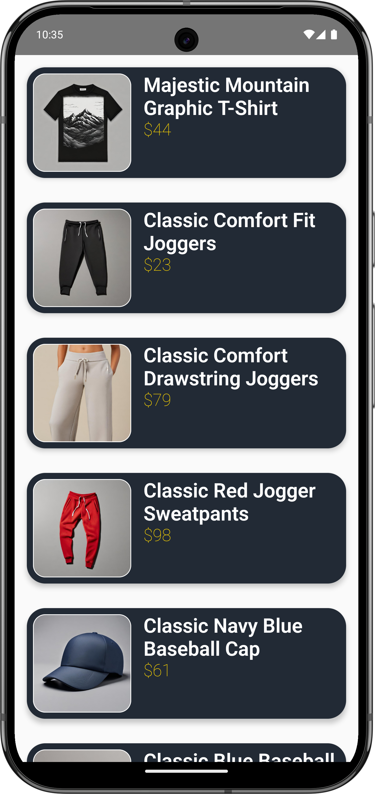

# fake-store-product
Android app that fetches and displays products from the FakeStore API using Jetpack Compose. This project uses key concepts such as HTTP requests, data modeling, basic UI composition, and screen navigation.

##UI
| Home Screen | Details Screen |
|----------------|------------------------|
|  |  |
